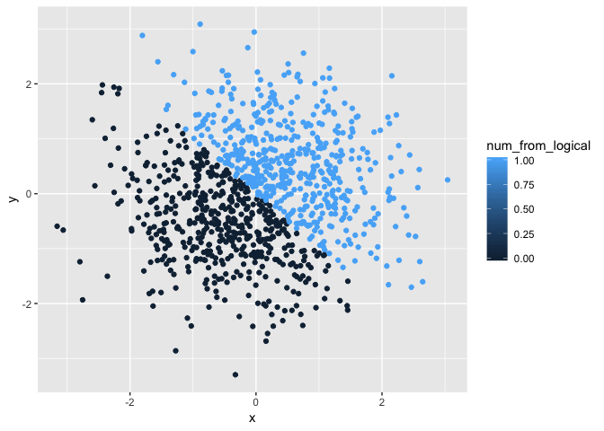
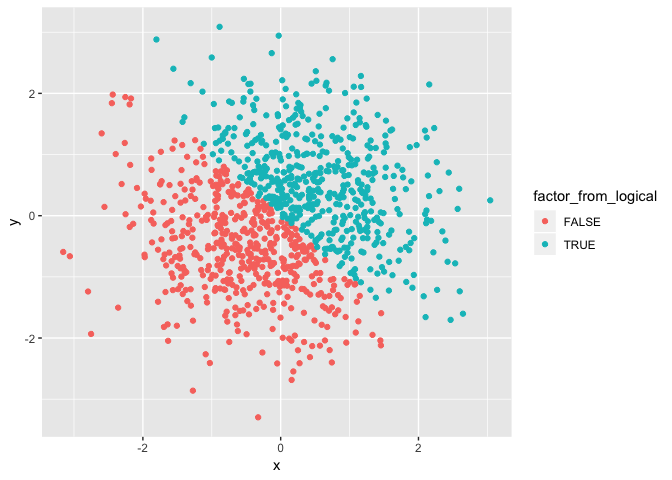

p8105\_hw1\_qw2282
================
Qinyao Wu
2018-09-13

Problem 1
=========

``` r
library(tidyverse)

#Create the data frame with numericals, logicals, characters and factors. 
df_random_samp = tibble(
   rand_samp = runif(10, min = 0, max = 5),
   logical_larger_2 = rand_samp > 2,
   rand_char = c("My", "name", "is", "Qinyao", "how", "are", "you", "nice", "weather", "today"),
   rand_factor = factor(c("january", "february", "march", "april", "may", "june", "july", "august", "semptember", "october"))
)

#Examine the length of characters and facotrs
length(df_random_samp$rand_char)
```

    ## [1] 10

``` r
length(df_random_samp$rand_factor)
```

    ## [1] 10

``` r
#Calculate the mean of each element in the data frame.
mean(df_random_samp$rand_samp)
```

    ## [1] 3.352615

``` r
mean(df_random_samp$logical_larger_2)
```

    ## [1] 0.9

``` r
mean(df_random_samp$rand_char)
```

    ## Warning in mean.default(df_random_samp$rand_char): argument is not numeric
    ## or logical: returning NA

    ## [1] NA

``` r
mean(df_random_samp$rand_factor)
```

    ## Warning in mean.default(df_random_samp$rand_factor): argument is not
    ## numeric or logical: returning NA

    ## [1] NA

Result of mean of each variable
===============================

Vectors of numerical values and logicals have means while the vectors of characters and factors do not have means. This is because the numerical values can be averaged into a numerical mean. And logicals, TRUEs and FALSEs, are also stored as integers. TRUEs are stored as 1s and FALSEs are stored as 0s. So when the mean function is called, the mean can be calculated with either 0 or 1. However, characters and factors are strings that do not have a numerical mean. As a result, a warning poped out

``` r
#Coerce logicals, characters and factors into numerics. 
as.numeric(df_random_samp$logical_larger_2)
as.numeric(df_random_samp$rand_char)
```

    ## Warning: NAs introduced by coercion

``` r
as.numeric(df_random_samp$rand_factor)
```

Only the logicals and factors can be coerced into numericals. The characters cannot be converted and 'NA' is displayed for each element and a warning message poped out.

``` r
#Coerce between factors and characters. 
as.numeric(as.factor(df_random_samp$rand_char))
as.numeric(as.character(df_random_samp$rand_factor))
```

    ## Warning: NAs introduced by coercion

Comment on the relationship between factors and characters
==========================================================

When I convert the vector of characters first into factor and then into numerics, the vector is successfully converted into numbers. However, when the vector of factors first being converted into characters and then into numerics, the coercion is unsuccessful and a warning message poped out. This is because the character cannot be coerced into numericals directly.

Problem 2
=========

``` r
#Define the data frame with x, y, logicals and factors. 
df_plotting = tibble(
   x = rnorm(1000, mean = 0, sd = 1),
   y = rnorm(1000, mean = 0, sd = 1),
   vec_compare = (x + y) > 0,
   num_from_logical = as.numeric(vec_compare),
   factor_from_logical = as.factor(vec_compare)
)
```

Description of the dataset
==========================

This data set includes 1000 rows and 5 columns. The size of the data set is 1000, 5.This data set includes three numerical vectors: x, y and a numerical coercion of the logical vector num\_from\_logical; one logical vector: vec\_compare; one factor vector: factor\_from\_logical. The mean of x is 0.0239569. the median of x is 0.0054896. The proportion of TRUE in the logical vector vec\_compare is 0.513.

``` r
#Plot and save the first figure of x, y. With color differentiated by logicals. 
ggplot(df_plotting, aes(x = x, y = y, color = vec_compare)) + geom_point()
```


``` r
ggsave("scatter_plot.pdf", height = 4, width = 6)

#Plot another two plots, colored by numerics and factors. 
ggplot(df_plotting, aes(x = x, y = y, color = num_from_logical)) + geom_point()
```



``` r
ggplot(df_plotting, aes(x = x, y = y, color = factor_from_logical)) + geom_point()
```



Comment on the color scale
==========================

The color scales of all three plots are the same because the factor vectors and the logical vectors are coerced from the logical vectors. True is coerced to 1 and False is coerced to 0. As a result, all three plots are showing the same color scale.
